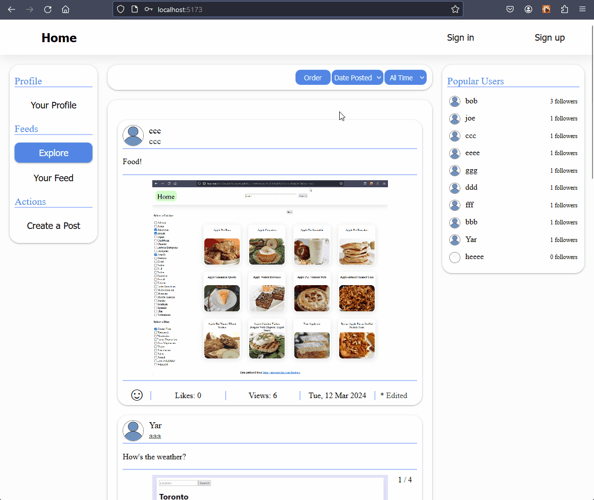

# SocialMediaApp

A social media application using react, flask, and postgreSQL

### Features for signed in users

### Sign in process

### Profile editing

### Viewing posts

### Sorting posts

### Following users

### Creating and editing posts

### Creating and editing comments

### Viewing profiles

